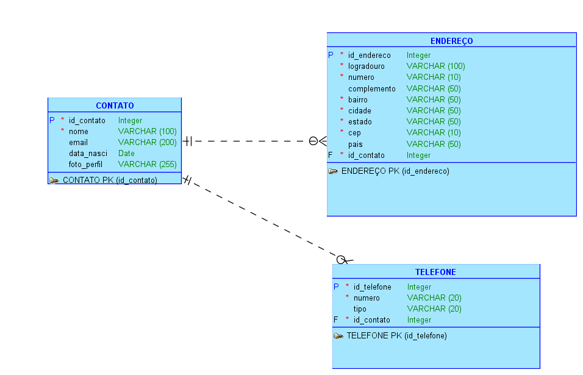

# 📇 Agenda de Contatos – Modelagem de Banco de Dados

Este projeto tem como objetivo modelar uma base de dados relacional para armazenar uma agenda de contatos, similar à usada em smartphones Android ou iOS.

## 🧠 Conceitos abordados

- Modelagem lógica de dados
- Entidades e atributos
- Chaves primárias e estrangeiras
- Relacionamentos 1:N
- Geração de script SQL (DDL)

## 🗂 Estrutura do banco

O banco é composto por 3 entidades principais:

### 📌 CONTATO
- `id_contato` (PK)
- `nome` (obrigatório)
- `email`
- `data_nasci`
- `foto_perfil` (caminho para imagem)

### 🏠 ENDEREÇO
- `id_endereco` (PK)
- `id_contato` (FK)
- `logradouro`, `numero`, `complemento`, `bairro`, `cidade`, `estado`, `cep`, `pais`

### ☎️ TELEFONE
- `id_telefone` (PK)
- `id_contato` (FK)
- `numero`, `tipo` (ex: celular, residencial, trabalho)

## 🖼 Modelo lógico

## 🧾 Script de criação (DDL)

Veja o conteúdo no arquivo [`script-criacao.sql`](script-criacao.sql)

## 🚀 Como usar

1. Copie o conteúdo de `script-criacao.sql`
2. Cole e execute no Oracle SQL Developer

---

### 💡 Autor
Matheus Nicácio – Estudante de graduação em Análise E Desenvolvimento De Sistemas(FIAP).

